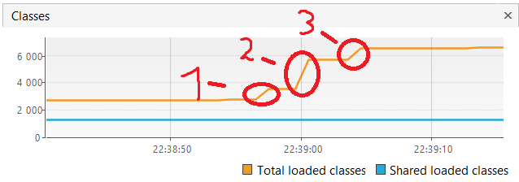
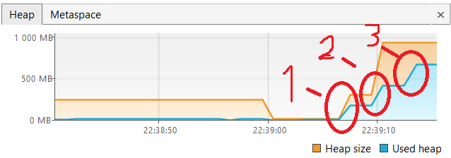
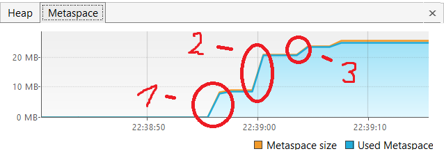

Происходит загрузка классов из зависимостей:
1. 22:38:56.775483700: loading io.vertx
2. 22:39:00.048994800: loading io.netty
3. 22:39:03.525074600: loading org.springframework

Создаются объекты в куче:
1. 22:39:06.705813500: creating 5000000 objects
2. 22:39:09.924188100: creating 5000000 objects
3. 22:39:13.077239500: creating 5000000 objects

Происходит загрузка информации о классах в metaspace:
1. 22:38:56.775483700: loading io.vertx
2. 22:39:00.048994800: loading io.netty
3. 22:39:03.525074600: loading org.springframework
